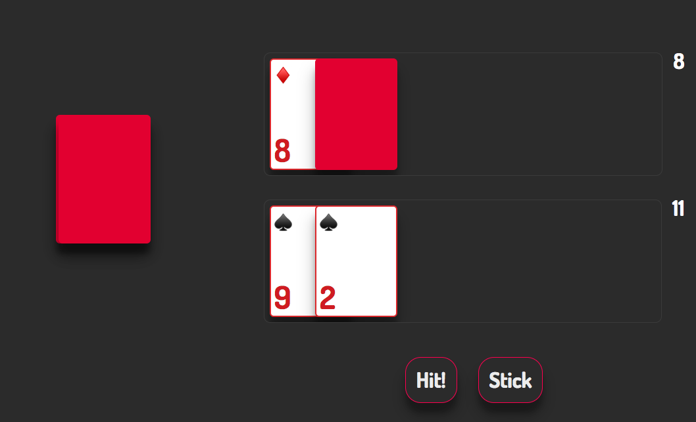

# Blackjack (feat. react)

_/Tiago Morais/_

> _This was produced as an exercise, as such, the code is incomplete and may (probably does) contain some bugs_

This is a (basic) version of the game blackjack in Javascript.  

The UI is built with `React` and vanilla `CSS`.   
Given how simple the game's state is, the game logic is written in vanilla `Javascript`.

For speed sake, the app was bootstraped using `create-react-app`

####  


---

## App structure
```
blackjack
└── src
    |__ logic
    |     /*The core game logic is here */
    |     /*Responsible to shuffling, dealing, counting, etc */
    └── state
    |     /*The code responsible for keeping/changing the app state is here */
    |     /*It's the layer to keep the UI functional */  
    └── ui
    |    /* The entire UI is built with react components */  
    |   /* All component but the top level contaier are stateless */
    |   /* They are simply rendering props */
    |
    └── index.js
    └── registerServiceWorker.js
```

---
## How to run

## Install dependencies
```
npm install
```

## Run locally
```sh 
npm run start
```

Open `http://localhost:3000` to view it in the browser.

## Run tests
For breviety/time sake, the tests are not super thourough,
but some tests were written for the core game logic.

```sh
npm run test
```

## Build for production
`npm run build`  
files will be in `/build` folder and can be server by a webserver.  

If you install `http-server` package you can serve the files at `localhost:8080`
```sh
npm install http-server
http-server /build
```
